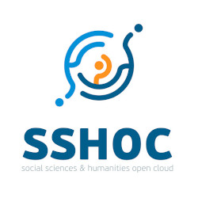

# About us

       

This project has been realized within the framework of [SSHOC](https://sshopencloud.eu/d41-sample-management-system-cross-national-web-survey), the Social Sciences and Humanities Open Cloud H2020, part of the Work Package "Innovations in Data Production", by [ESS-ERIC](https://europeansocialsurvey.org) and [the CDSP at Sciences Po](https://cdsp.sciences-po.fr).

Orchestrated by the Consortium of European Social Science Data (CESSDA ERIC), the Social Sciences and Humanities Open Cloud (SSHOC) aims to regroup innovations driven by european research infrastructure under a common umbrella of cloud services made accessible to the social sciences and humanities academic community.   

This project contributes to the European Open Science Cloud (EOSC) initiative, the broader aim of which is to offer the scientific community a cloud-based access to an open set of tools, services and training resources.

As part of the SSHOC work package 4 on `innovations in data production`, led by the European Social Survey, CDSP's software solutions team is responsible for the development of a `Web Panel Sample Service`: a web application used to manage international panels and field online surveys at the European scale.

The SSHOC project was funded as part of the European Union's Horizon 2020 (H2020) program for research and innovation, and started its 40-month agenda on january 1st 2019. Sciences Po is among the 19 partners involved.

This endeavour builds on experience and skills acquired along the ELIPSS project, the operation of which relies on a customized panel management application continuously improved for almost 10 years.

 This project has received funding from the European Union's Horizon 2020 research and innovation programme under grant agreement No 823782.

