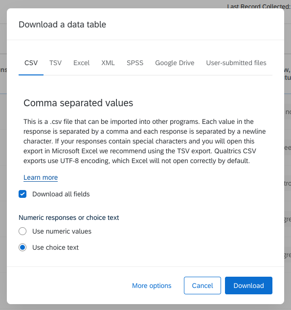
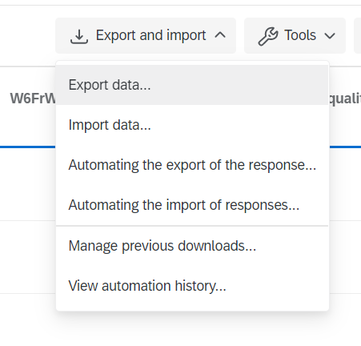
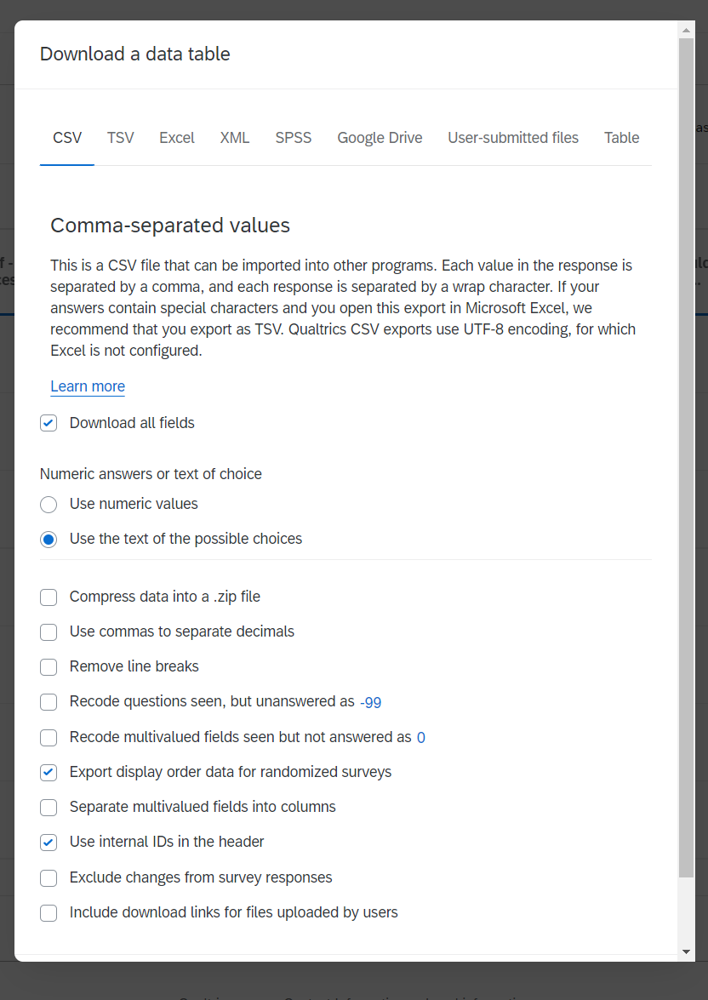
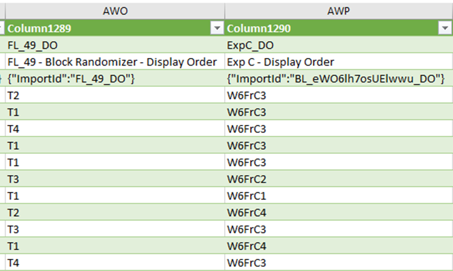

# In brief: data archive staff

Data archive staff is the only role that is granted access to pseudonymized survey data on the survey platform.

Survey data are available in various formats:

Questionnaire metadata are available as a `.qsf` file (for Qualtrics Survey Format) in structured format (JSON), a rather good candidate for documenting.

Qualtrics doesn't provide extensive documentation about this file format, but we've found here a very useful ["Quickstart Guide to understanding the Qualtrics Survey File", by Christian Testa](https://gist.github.com/ctesta01/d4255959dace01431fb90618d1e8c241).

In addition, [Colectica starting version 6.2](https://www.colectica.com/news/Colectica-62-released/) provides a Qualtrics `qsf` to DDI import feature.

*[DDI]: Data Documentation Initiative, a set of metadata open standards for data documentation. See also https://ddialliance.org/products/overview-of-current-products

## Exporting embedded data

During survey development, [a selection of sample variables](../nc/sample-import-export-fields/) have been qhared with the survey platform as [embedded data](../survey/survey-creation/#mandatory-embed-data). These embedded variables are available for download by authorised role (data archive staff) along with survey data.

## Exporting randomisation information

A survey can be designed to use different levels of randomisation. Between blocks and inside some blocks some questions can be displayed randomly.

For the sake of data survey analysis, it is crucial to know how the blocks and questions were displayed.

To do so, before exporting the data from Qualtrics, select desired options in the menu: `Data and analytics` → `Export and Import` → `Export data` → `More options`.

Then, click on **Export display order data for randomized surveys**.

This will automatically include additional variables in the exported file, informing the different levels of randomization.

For example for CRONOS-2 wave 6:

- the randomised group respondents were assigned to `Block randomizer -- Display order`

- the text vignette they received `BExp C -- Display order`.

