# Managing fieldwork

## Publishing a survey

Once all preliminary steps have been performed (checking [questionnaires](questionnaire.md) availability and translations completeness), the study coordinator is able to invite sample(s) to answer a survey. To be able to intertwine emails and short text messages modes as well as to get one unique answer per panelist, we use [**individual links**](#create-a-link-set) as our only way to invite respondents to answer a survey. This is done behind the scene trough the survey platform API.

### Create a link set

Once a questionnaire has been created and translated and the samples are ready to receive invitations, the next step will be to create a set of individual links. Select the `Individual links` card.

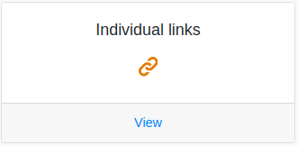

To trigger the link set creation, click on the green `create` button and fill in the form. You will have to select:

- the questionnaire
- all sample that the survey should be distributed to (using the `Ctrl` button to allow multiple selection in the `Panels` drop-down list as shown below)

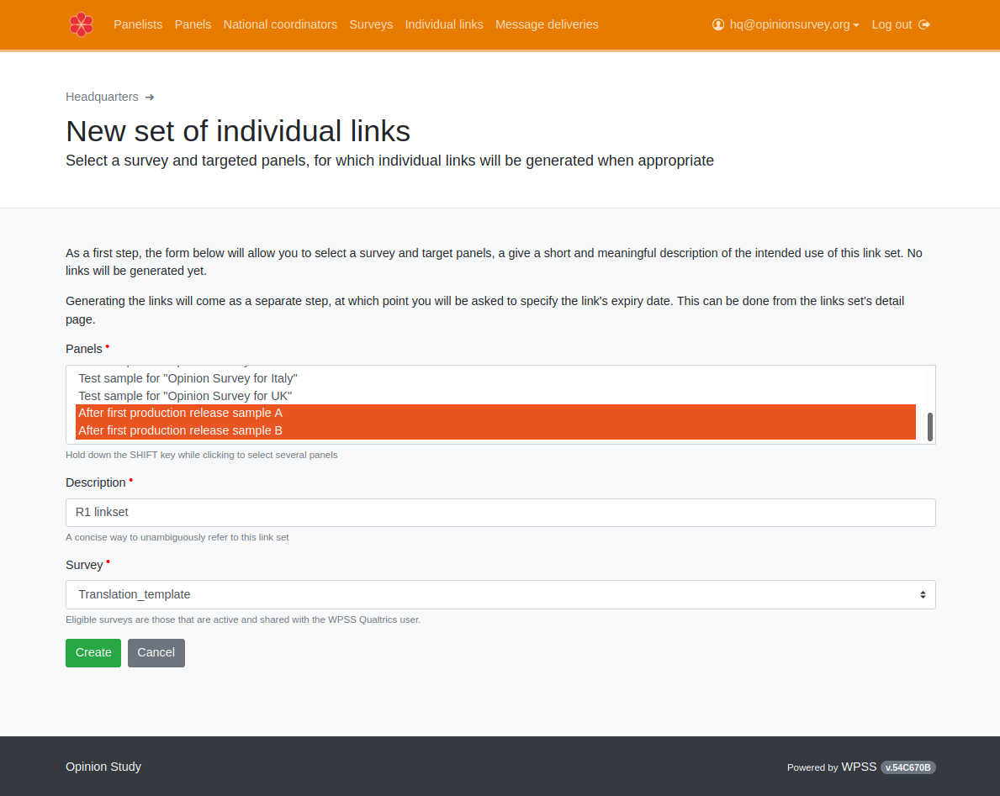

The newly created link set will appear in the list. To actually trigger the link set creation, click on the UID (first column, in blue).

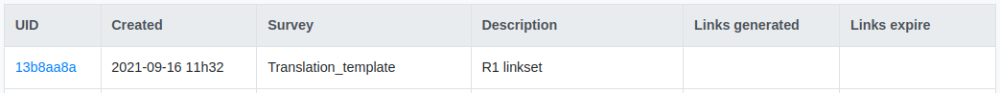

You can check that the survey and the samples it will be published are accurate. Click now on `Generate links`:

Choose and **expiration date**, meaning the deadline after which all unused individual links to the survey will not allow panelists to answer anymore.

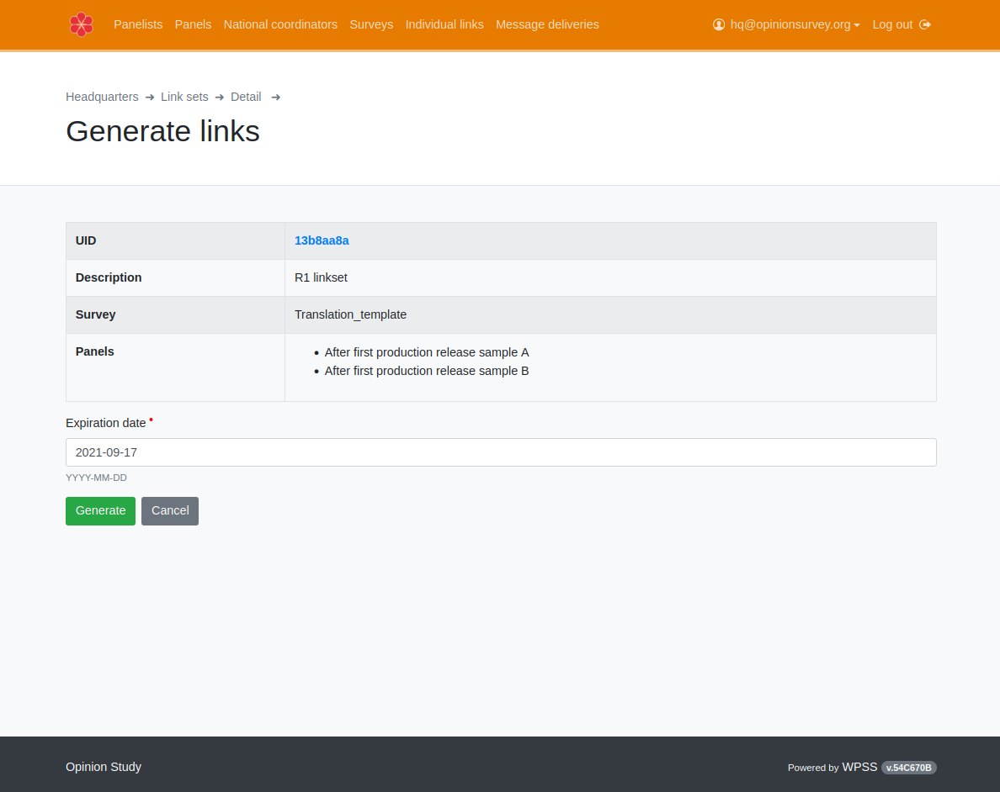

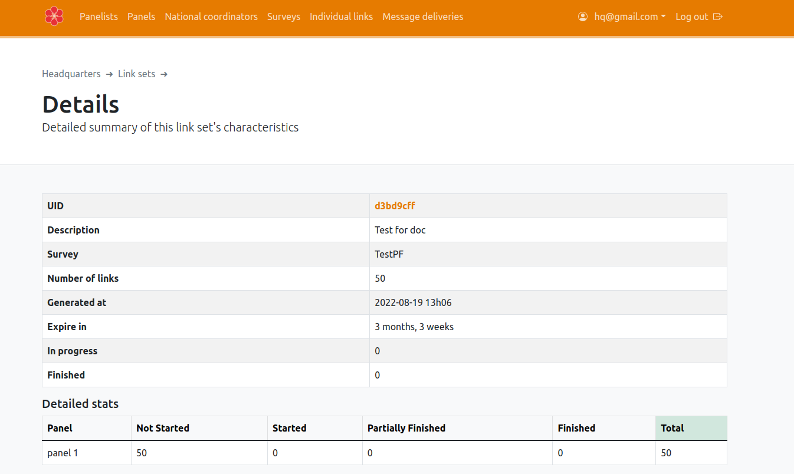

!!! Info
    As soon as a link set is generated, every included panelist can see their individual link by logging into their account on the [WPSS panelist portal](/p/).

## Sending messages

### Sending invites

It may be convenient to send an email or a text message to eligible panelists, drawing their attention on a new survey being available, and directly giving them the link they would otherwise find on their portal page.

This is exactly the purpose of Message Deliveries. For an existing individual link set, the message delivery procedure lets you choose a **primary or preferred mode** (email or SMS), a message template to use, a subset of panelists to target (eg, those who haven't started the survey yet) and schedule a sending date.

You can also optionaly add a **fallback contact mode**, that will be used to get in touch with panelists not reachable by the primary channel.

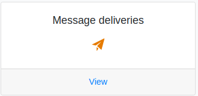

Let's distribute a survey, with email as primary mode. Click `New email delivery`:

You will have to choose:

- a link set (using its meaningful name and element UID)
- target recipients, in this case `All panelists`, to target all panelists belonging to the sample you choosed for the link set.
- For a reminder, you would typically choose `Not finished`. For a thank you email, you would probably choose `Finished`.
- a message from the survey platdorm shared messages library that was created by a [messages editor](../m/index.md))

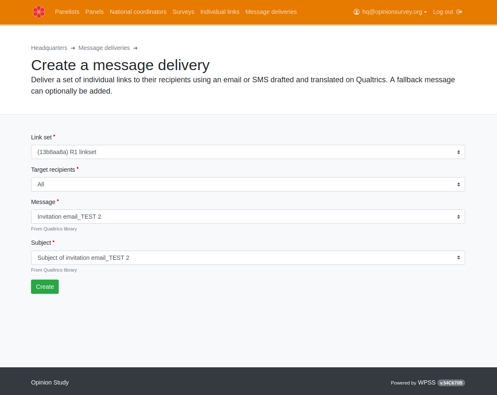

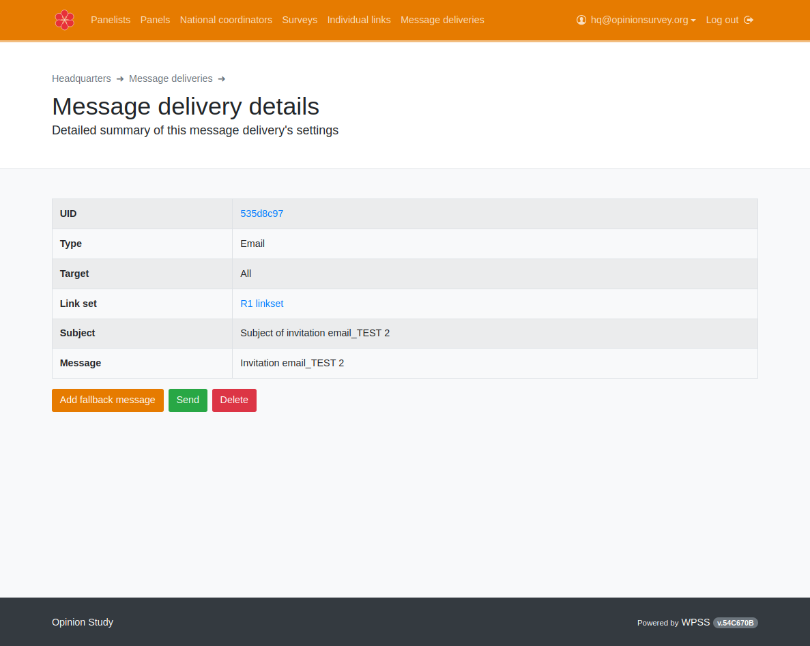

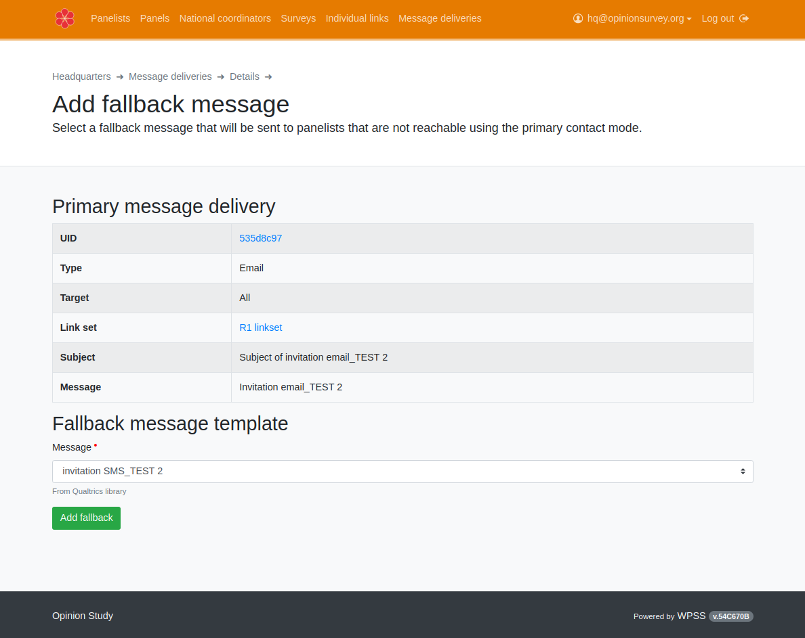

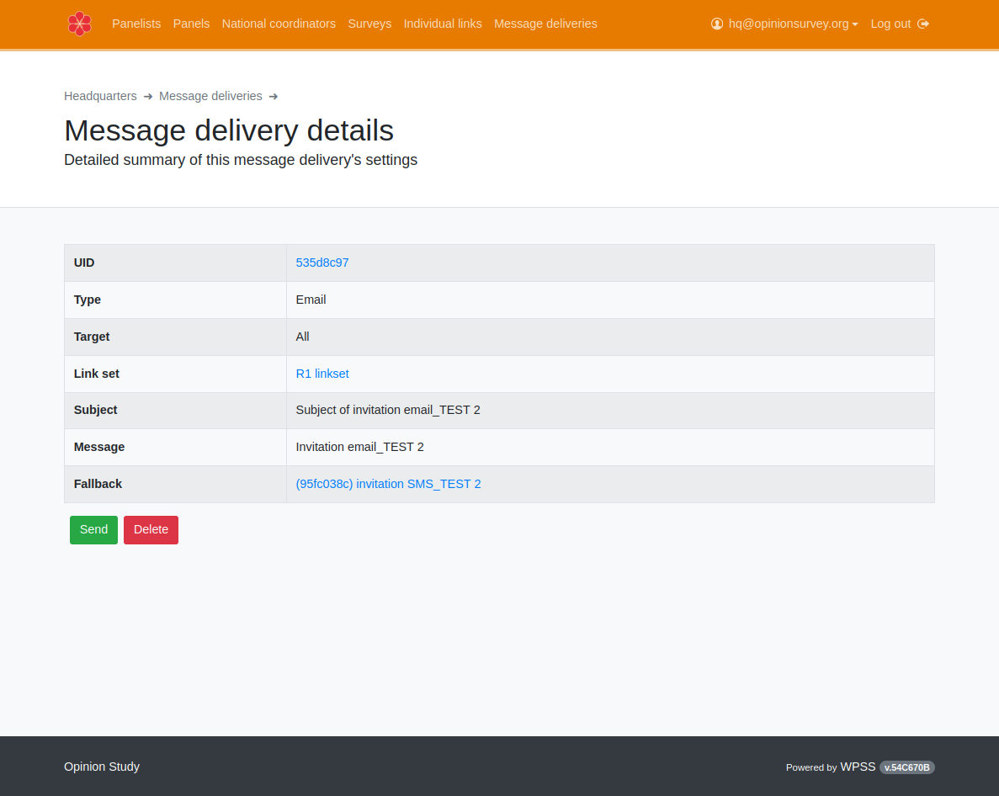

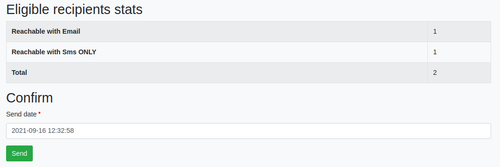

### Sending reminders

Link sets can be used as many time as desired to send reminders, using preferred principal mode and optional secondary (fallback) mode.

As an example, we will now send a reminder using primarily short text messages, only to panelists who either did not complete the survey or did not event start it.

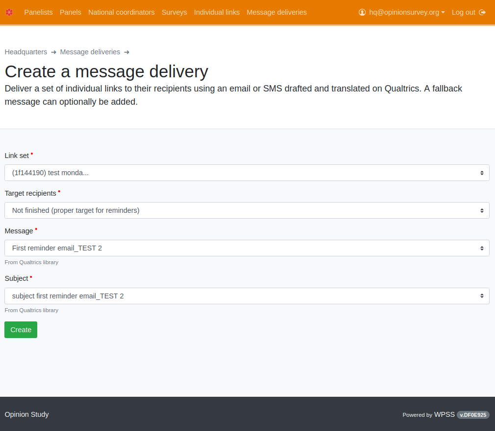

## Monitoring

### Messages

Messages are actually sent by the survey platform, that provides in return informations regarding the process. In WPSS, this information is displayed as statistics.

#### Emails

Email delivery data are available through Qualtrics API. Email messages statistics are automatically available. They will include the following items:

| Category            | Notes                                                                                                                                                                                                                                                                                                                                               |
|---------------------|:----------------------------------------------------------------------------------------------------------------------------------------------------------------------------------------------------------------------------------------------------------------------------------------------------------------------------------------------------|
| `Current Panelists` | The count of panelists presently belonging to the panel. This number may be higher than the number of messages sent for different reasons among which: - A panelist is added to the panel after the message was scheduled to be sent. - A panelist is not reachable by the chosen contact mode - A panelist has opted out from messages |
| `Attempted`         | The count of panelists who will receive a link by email if everything goes well                                                                                                                                                                                                                                                                     |
| `Delivered`         | The number of messages that were sent, or that are scheduled to be sent by Qualtrics. If the sending is scheduled in the future, all subsequent columns should be zero.                                                                                                                                                                             |
| `Opened`            | Lower bound of the number of panelists having opened the email. Example: a value of 10 would mean that at least so many panelists have opened the email, but the actual number may be higher if some messages were opened unbeknownst to Qualtrics                                                                                              |
| `Soft Bounce`       | Number of emails that bounced back for a temporary reason (a full mailbox for example)                                                                                                                                                                                                                                                              |
| `Hard Bounce`       | Number of emails that bounced back due to a permanent reason (an invalid address for example)                                                                                                                                                                                                                                                       |
| `Other Failures`    | Emails that failed to be sent and did not “bounce back” (an email address that is spotted as invalid before sending, for example)                                                                                                                                                                                                                   |

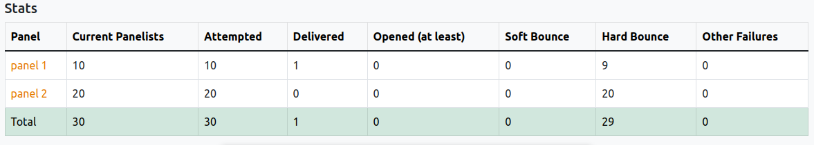

The click on `Panel name` buttons provides this information at an individual panelist level.

#### SMS

Short text messages delivery data are **not** available through Qualtrics API. The WPSS support staff has to manually download and pre-process data from Qualtrics web interface before SMS statistics can be made available on WPSS. To get detailed statistics of an sms distribution, you must commuicate to the support staff the WPSS ID of the desired distribution (see table and screenshot below).

Short text messages statistics include the following items:

| Category           | Notes                                                                                                                                                                    |
|--------------------|:-------------------------------------------------------------------------------------------------------------------------------------------------------------------------|
| `UID`              | UID (identifier) of the SMS delivery. This ID should be provided to the support staff first                                                                              |
| `Links to send`    | Number of links delivered by this message. The count may be less than reported as “Sent” by Qualtrics in case several trials are necessary to send at least one message. |
| `Sent`             | Number of logical messages reported as sent by Qualtrics (one logical message may, if too long, break up in several “physical” SMS messages)                             |
| `Failed`           | Messages the survey platform failed to send                                                                                                                              |
| `SMS messages consumed`   | Number of SMS messages reported as sent by Qualtrics                                                                                                                     |
| `Credits consumed` | Amount of Qualtrics SMS credits consumed                                                                                                                                 |

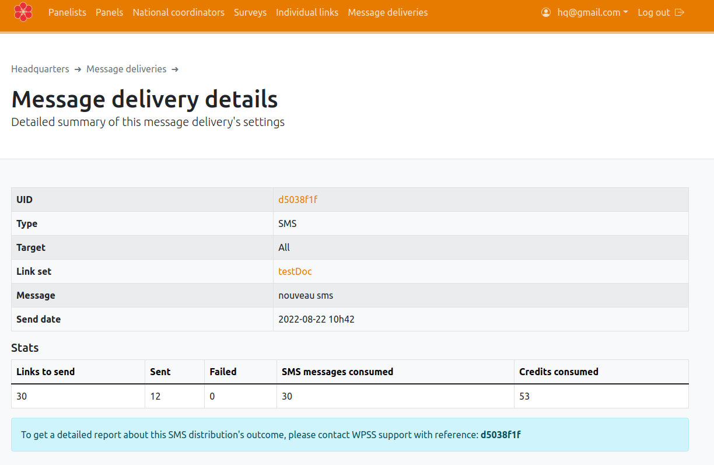

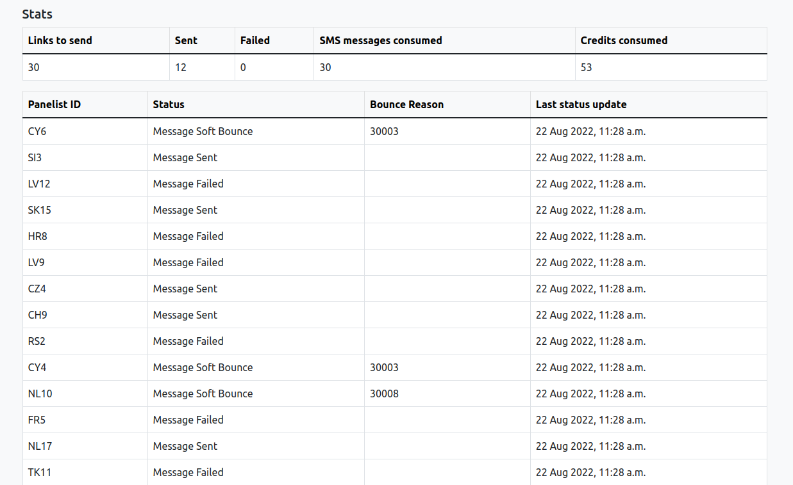

### Response rates

Select the `Individual links` card.

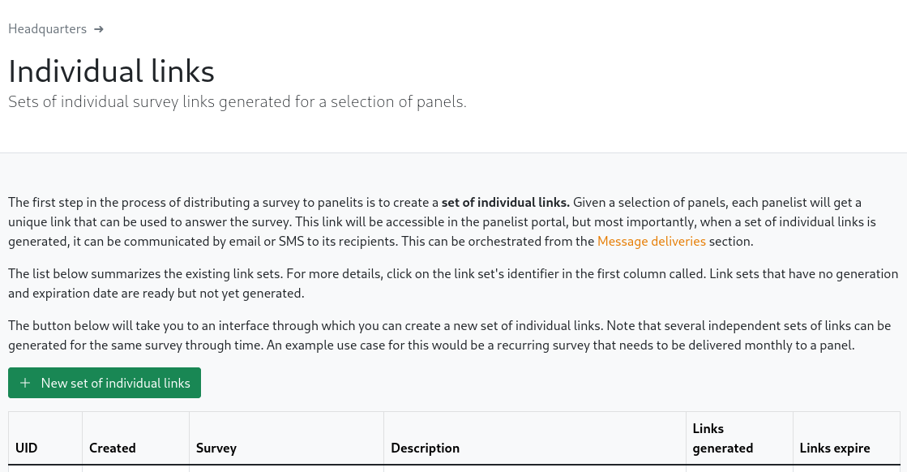

From the individual links set created, a list is displayed. Click on the desired links set identifier to browse details of response rates.

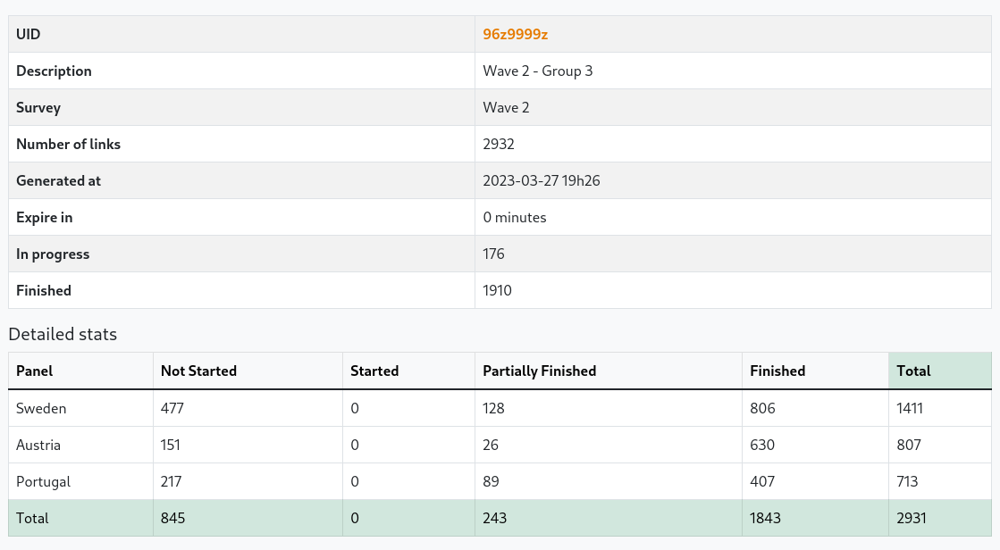

Results are grouped by sample, and the following categories are shown:

| Category                                                                         | Notes                                                                                                                                                                                                                                 |
|----------------------------------------------------------------------------------|:--------------------------------------------------------------------------------------------------------------------------------------------------------------------------------------------------------------------------------------|
| Not Started                  | Panelist did not start the survey                                                                                                                                                                                                     |
| Started                      | Panelist started the survey, but did not complete it. The survey deadline still allows him/her to finish the survey                                                                                                               |
| Partially Finished | Panelist started the survey, but did not complete it. The survey deadline no longer allows him/her to finish the survey. His/her responses are recorded                                                                             |
| Finished                       | Panelist completed the survey by answering all questions                                                                                                                                                                              |

