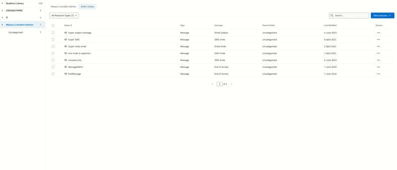

# Other operations

<!--TODO-->
## Exports

Study coordinators can export [sample contact data](../nc/sample-import-export-fields.md) (in one batch). Data are pseudonymised.

## Blank slots - custom variables

Study coordinators are able to add as many blank slots (additional typed variables) as needed. All this custom variables are available in the survey platform as **embedded data**, to be used for instance for survey routing:

- as randomisation variables,
- as grouping variables.

To create a new custom variable, go to `Panelists` and select the button below:

The list of already defined cutom variables is displayed.

## Exports from Qualtrics

### Export Survey Code

To export the survey code, follow these steps:

- Select the relevant survey
- Select "Tools"
- Select Import/Export
- Select "Export survey"

The file will be downloaded in .qsf format, and can be used to import the survey into another Qaultrics instance.

Warning: This file must not be modified in any way.

### Export message from library

To export a message from the Qualtrics library :

- Select the relevant message
- Click on the 3 dots to the right of the message
- Select "Translate message"
- On the left of the screen, click on the arrow to download the message.
- Select the desired languages
- Click on "Download"
