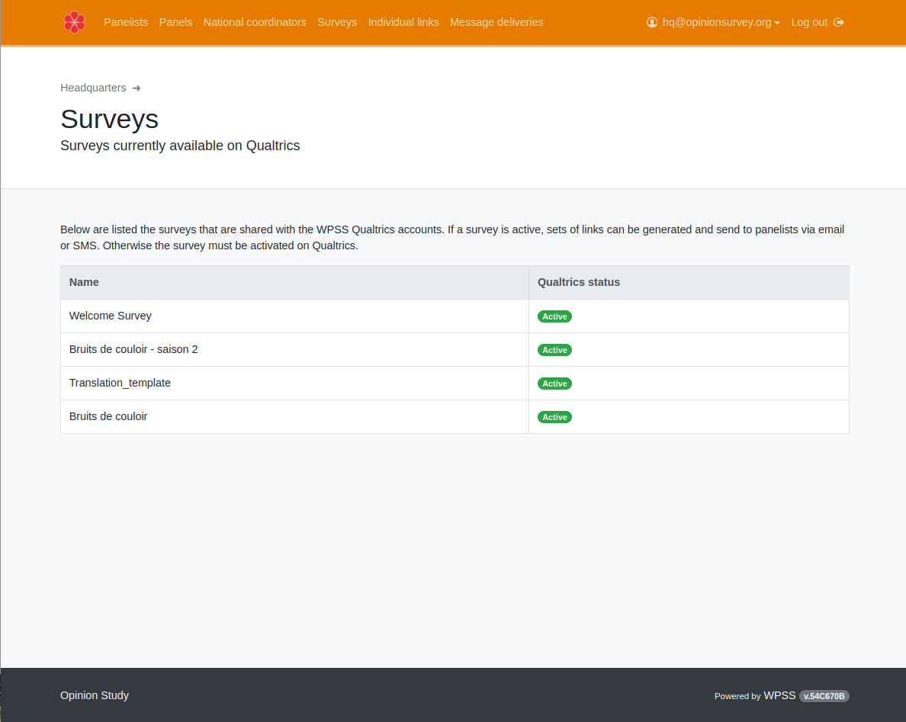

# Managing questionnaires

???+ Warning ""

    To proceed to next step [the survey editor must have shared the questionnaire](../../survey/survey-collaboration/#publish-the-survey-on-wpss) with WPSS.

The study coordinator is now able to view the list of all surveys available on the survey platform.
To do so, the study coordinator will <!-- , including hints on translation progress --> select `Surveys` in the navigation bar or the `Survey card` on the WPSS portal.

A list of questionnaire available is displayed. The study coordinator is now able to [invite samples](fieldwork.md) to answer this survey.

