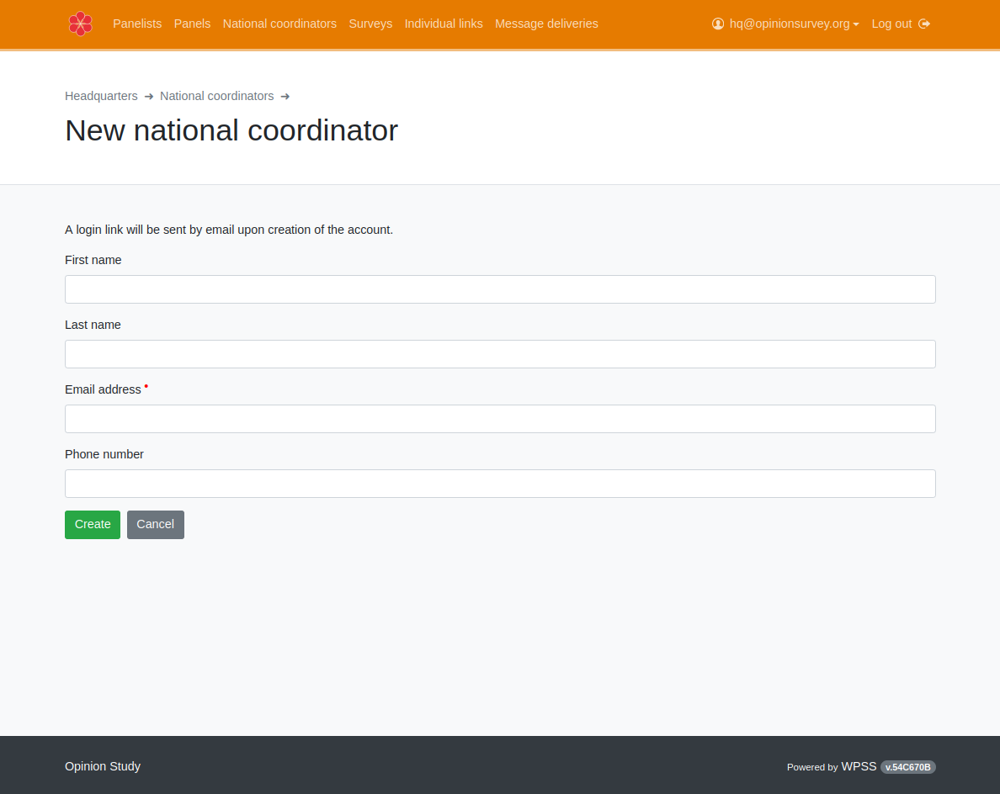
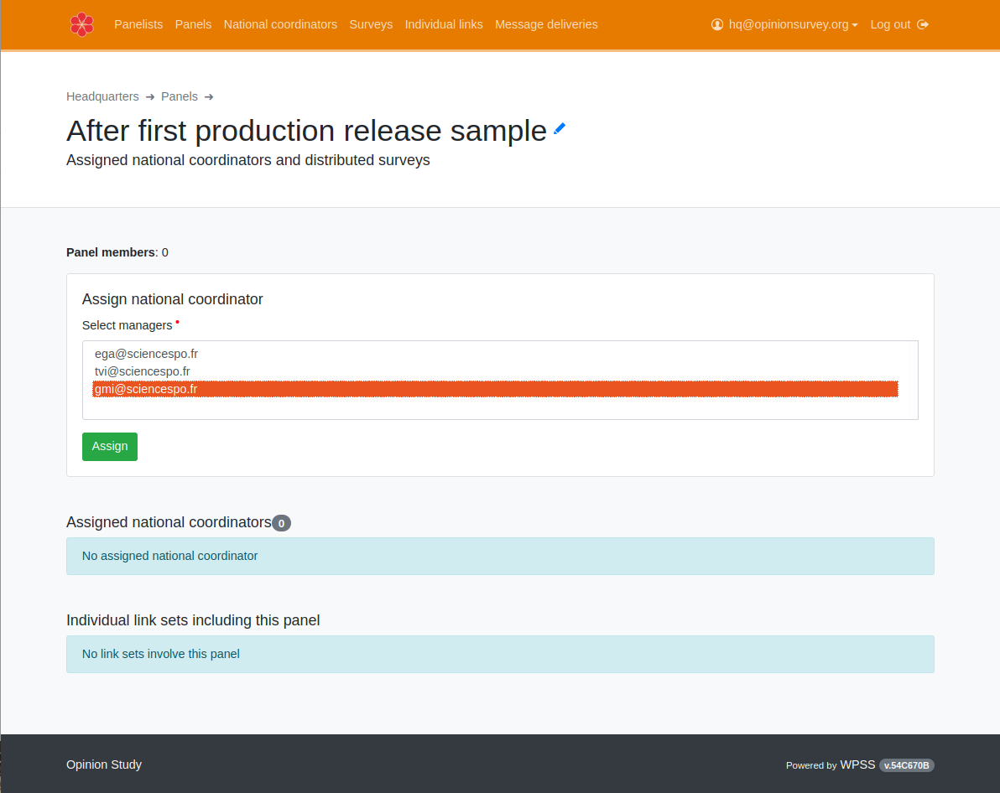

## Creating sample manager accounts
To do so, choose `National coordinators` from the navigation bar.
Click now on `new national coordinator` to fill in the sample manager creation form (mandatory values are marked with a red dot):

## Creating samples
To do so, choose `Panels` from the navigation bar or the `Panels` card.

Click now on the `new panel` button. You will only have to **name** this new panel, and **assign at least one sample manager** (national coordinator) [you created earlier](/hq/seeding-a-study/#creating-sample-manager-accounts).
## Assigning sample managers to samples
You can assign several sample managers to one single sample. You can also assign several samples to one single sample manager.

To assign sample managers to a sample, select `Panels`, and click on the sample name in the list to edit:

You are now able to select at least one sample manager account (national coordinator) and click on the `Assign` button. The `Panels` listing will show the sample status, that is ready for the [sample manager to populate](/nc/in-brief/).

