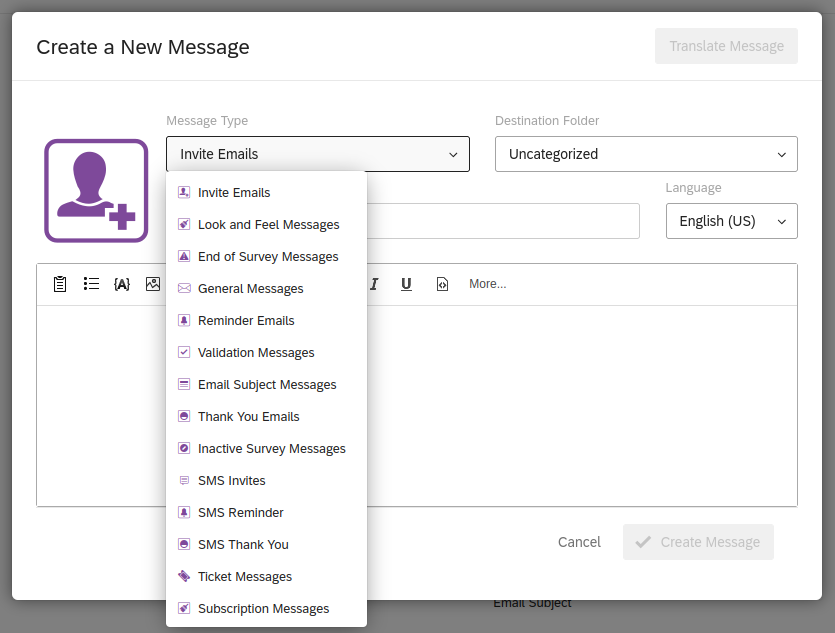
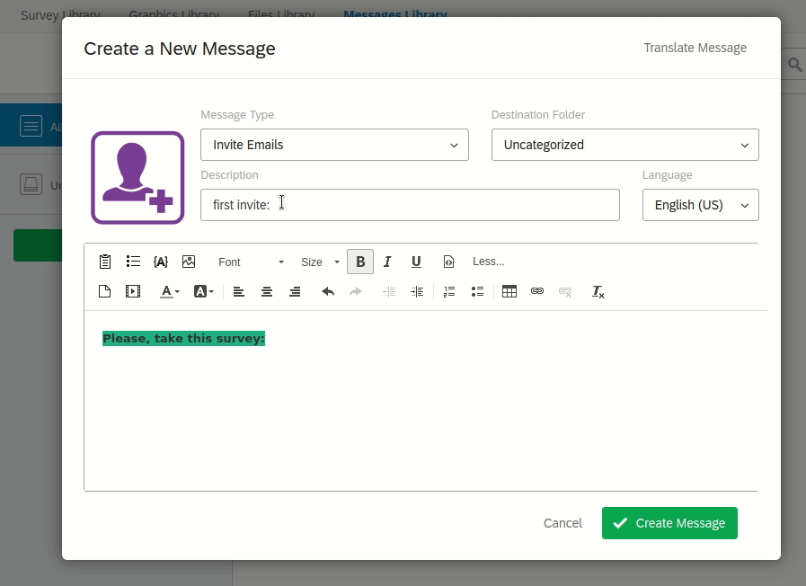
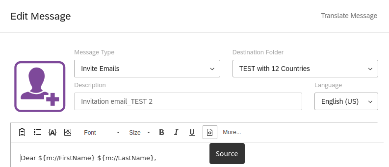
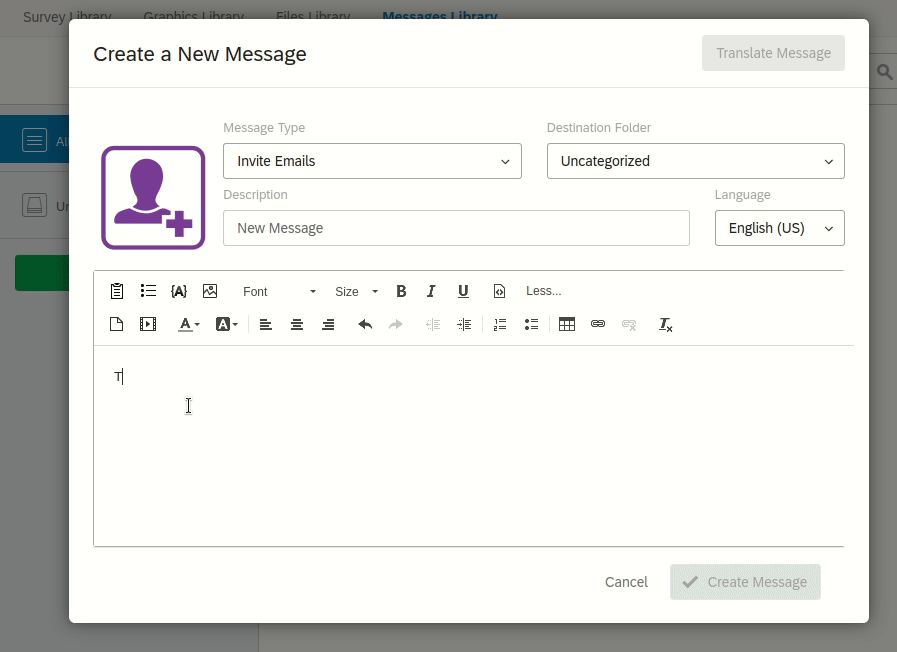

# Message edition
## Message pre-publication

To be available for use by the Study Coordinators, messages have to be created in a previously agreed) shared message Library.

To begin with message edition, Survey platform instructions are available [here.](https://www.qualtrics.com/support/survey-platform/account-library/message-library/#CreatingAMessageInALibrary)

## Three messages types
Three messages types are used by WPSS:

- Email
- Email subject
- Short Text Message
Where to define a new message type:



## Embedding a survey link
Wether invitations happen by email or Short Text Message, the text has to include a link to answer the survey. For WPSS the link type used is exclusively a `personal link`.

For WPSS invitation to function as excpected, It is crucial that you follow the guidance provided below.

### Email messages

Follow the steps on this short screencast:



To make sure the survey link will be a hyperlink (the respondent can click on the link and be directly opening the survey), you will have to write some specific HTML code.
To do so, activate the source editor  by clicking the toggle `preview/view source` button:



You should see the message displayed as source HTML code.

```
<br />
Please go to the SURVEY now by clicking below<br />
${e://Field/survey_link}
<br />
```

Replace the following text:
```
${e://Field/survey_link}<br />
```
By the text below:
```
<a href="${e://Field/survey_link}">${e://Field/survey_link}</a>
```

Alternatively, you may want to replace the survey link that is displayed, by a text or a sentence like below:

```
<a href="${e://Field/survey_link}">Click me</a>
```
### Short text messages
Follow the (unorthodox) steps on this short screencast:


