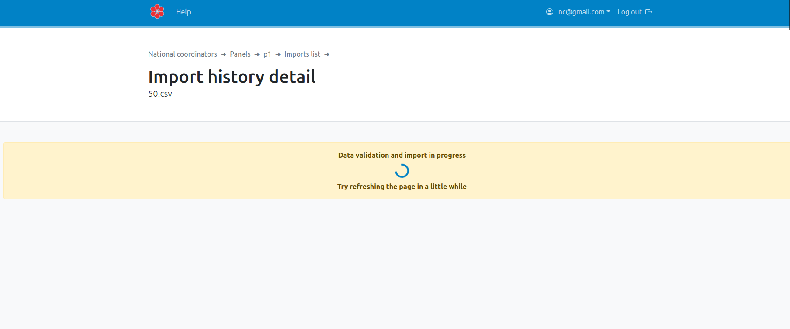

## Recommended tools
In a multilingual and cross-national context, we strongly advice to use the free and open source office suite [LibreOffice](https://libreoffice.org) to produce the sample file used to import each sample data file.

To open a file with LibreOffice, use right click the `Open with` and  `LibreOffice calc`, each time you need to process the file, avoiding to save it using Excel.

## Sample template file
The sample file data that has to be imported in WPSS must follow several rules:

- CSV format
*[CSV]: Comma separated value
- header names
- column count
- mandatory values

A template file is available to download in the WPSS portal. Follow the steps to download a template file: connect to WPSS as a sample manager, select `panel` and click on your assigned sample. Click the  then .

Following this template as well as [the specifications](sample-import-export-fields.md), you will now be able to produce the import file as expected. Several issues may arise.

## Troubleshooting

- Check column headers names accuracy
- Check mandatory variables, user language [lng](../sample-import-export-fields/#lng) variable for example
- Check the mobile [phone number](../sample-import-export-fields/#mobile) variable specifications

To transform a mobile phone number value into an international format with LibreOffice.
Insert an empty column before the `mobile` column. In the new column, on the first cell value, type a formula (depending on your initial mobile value). Once the formula is correct, copy the formula to the fields below (drag and drop the bottom right corner of the formula cell). Copy the newly calculated column (copy, paste special, text) before removing the initial mobile column. Add column header `mobile`.

Initial field value of `611223344` in `Cn` cell:

    concat("+33",Cn)
Initial field value of `0611223344` in `Cn` cell:

    concat("+33",right(Cn,9))

## Saving the sample CSV file
Once the sample file follows the specifications, it can be saved.
WPSS and the survey platform rely on an international characters encoding UTF-8.
*[UTF-8]: Variable-width character encoding used for electronic communications, capable of handling text expressed in most of the world's writing systems.
Sample managers have to save a copy of the sample file as an UTF-8 encoded CSV with LibreOffice,
In the `File` menu, select `Save as`, then `Text CSV (.csv)`, choose `Edit filter settings` option `Field delimiter -comma-`, Encoding `UTF-8` as shown below:

## Import the sample CSV file into WPSS
Once connected to WPSS, the sample manager
Select `Browse`, choose the sample CSV file, then `Confirm`.

## Monitoring the import process
A message invites you to refresh the page in a few moments:

When the import process is over, refreshing the page will display the result of the import.
If anything went wrong, the process will be cancelled and the page will show the errors line by line:

If everything went well, import statistics are displayed:

## History

To access the import's history, choose `Import history` from the navigation bar or the Panels card.

Import dates and import statuses (success or failure) about the panel are shown.

By clicking on the name of the CSV file, you can access the details of the import.

## Notes

You can batch update panelists information using the import feature. The CSV containing the current state of the sample can be exported from the export menu, then updated and imported again. Make sure you export the sample with the default fields as they are the only one allowed for imports.
