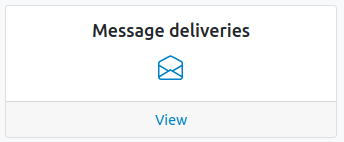
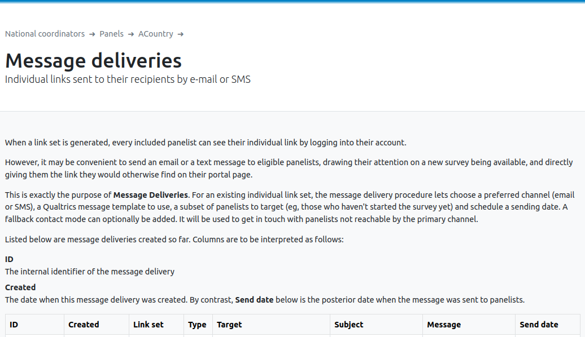
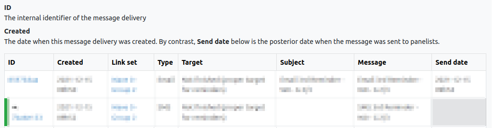
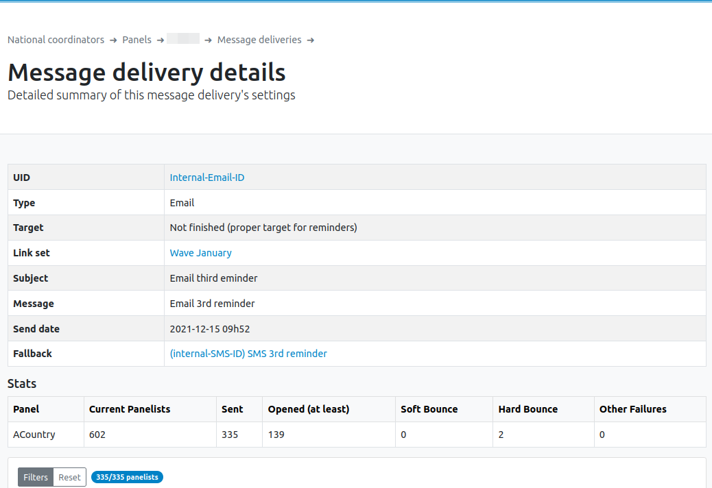
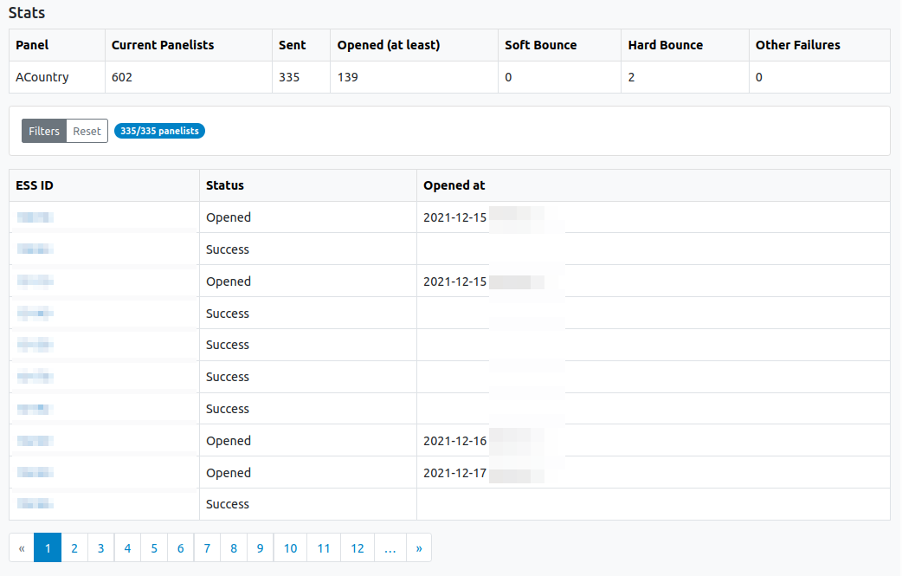
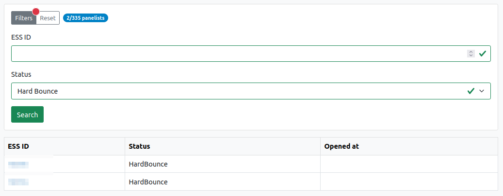
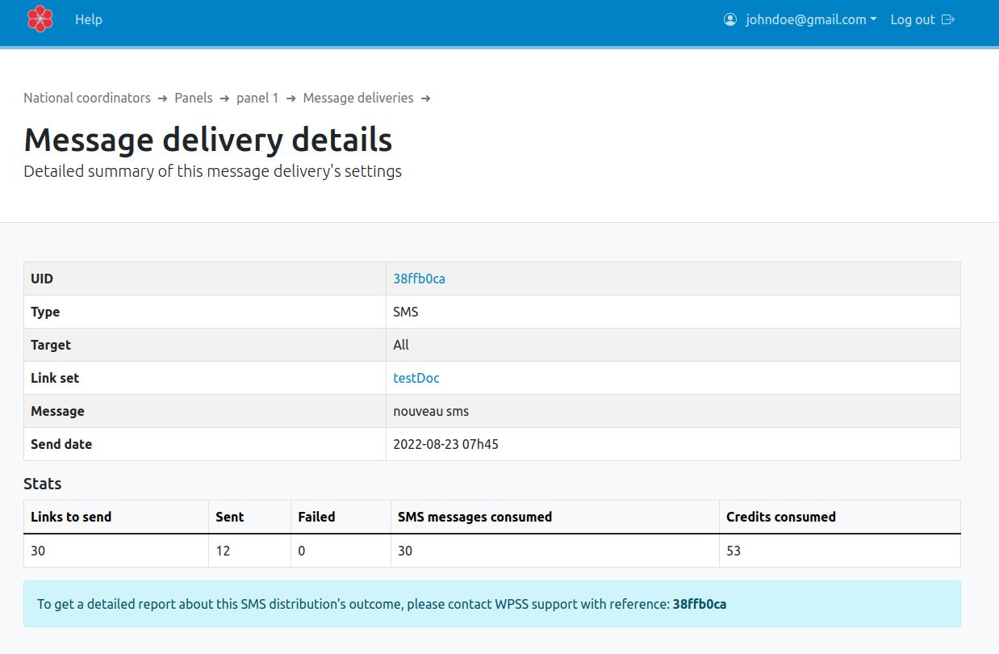
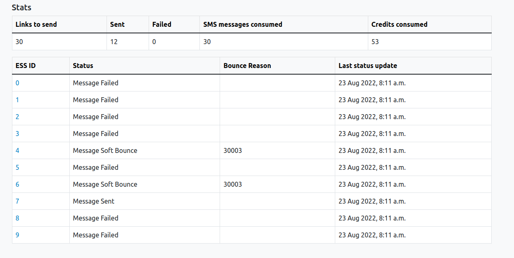

## Monitoring a message delivery

To do so, select the `Message delivery` card.

This card provdes access to the list of all messages deliveries involving the selected sample have been created.

A message delivery is characterized by:

- an internal ID (for debugging purposes only),
- a set of individual links (to a survey) used,
- a target: a message delivery can target all panelists (an invite) or panelists that did not yet complete a survey (a reminder),
- a `created` and a `sent` date (a message delivery can be scheduled),
- a message and its subject,
- a Type (email or SMS). A message delivery can optionally be used as a fallback for another message Type. For example, the study coordinator wants to send an email invitation to all panelists reachable by email, and a SMS fallback only for all panelists only reachable by SMS. The fallback message row is marked with a green horizontal bar.

Clicking on the message internal ID (in blue) opens the detailed vue of the message delivery.

## Email delivery details ##

Besides the delivery details, each email detailed delivery page shows global statitics:

| Category            | Notes                                                                                                                                                                                                                                                                                                                                               |
|---------------------|:----------------------------------------------------------------------------------------------------------------------------------------------------------------------------------------------------------------------------------------------------------------------------------------------------------------------------------------------------|
| `Current Panelists` | The count of panelists presently belonging to the panel. This number may be higher than the number of messages sent for different reasons among which: - A panelist is added to the panel after the message was scheduled to be sent. - A panelist is not reachable by the chosen contact mode - A panelist has opted out from messages |
| `Attempted`         | The count of panelists who will receive a link by email if everything goes well                                                                                                                                                                                                                                                                     |
| `Delivered`         | The number of messages that were sent, or that are scheduled to be sent by Qualtrics. If the sending is scheduled in the future, all subsequent columns should be zero.                                                                                                                                                                             |
| `Opened`            | Lower bound of the number of panelists having opened the email. Example: a value of 10 would mean that at least so many panelists have opened the email, but the actual number may be higher if some messages were opened unbeknownst to Qualtrics                                                                                              |
| `Soft Bounce`       | Number of emails that bounced back for a temporary reason (a full mailbox for example)                                                                                                                                                                                                                                                              |
| `Hard Bounce`       | Number of emails that bounced back due to a permanent reason (an invalid address for example)                                                                                                                                                                                                                                                       |
| `Other Failures`    | Emails that failed to be sent and did not “bounce back” (an email address that is spotted as invalid before sending, for example)                                                                                                                                                                                                                   |

Detils are shown on a panelist level.

Results can be filtered by study ID (ESS ID) and delivery status.

## SMS delivery details ##

First, after a distribution has been sent by sms, you have access to general statistics on the sending.

| Category           | Notes                                                                                                                                                                    |
|--------------------|:-------------------------------------------------------------------------------------------------------------------------------------------------------------------------|
| `Links to send`    | Number of links delivered by this message. The count may be less than reported as “Sent” by Qualtrics in case several trials are necessary to send at least one message. |
| `Sent`             | Number of logical messages reported as sent by Qualtrics (one logical message may, if too long, break up in several “physical” SMS messages)                             |
| `Failed`           | Messages the survey platform failed to send                                                                                                                              |
| `SMS messages consumed`   | Number of SMS messages reported as sent by Qualtrics                                                                                                                     |
| `Credits consumed` | Amount of Qualtrics SMS credits consumed                                                                                                                                 |

To have detailed statistics of a SMS distribution, you must transmit to the support the id of the desired distribution.

Then a new table will appear on the same page with individual statistics.

