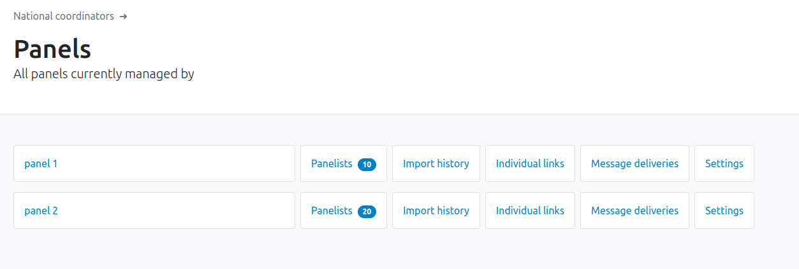
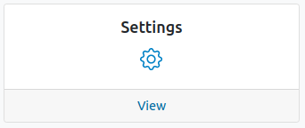
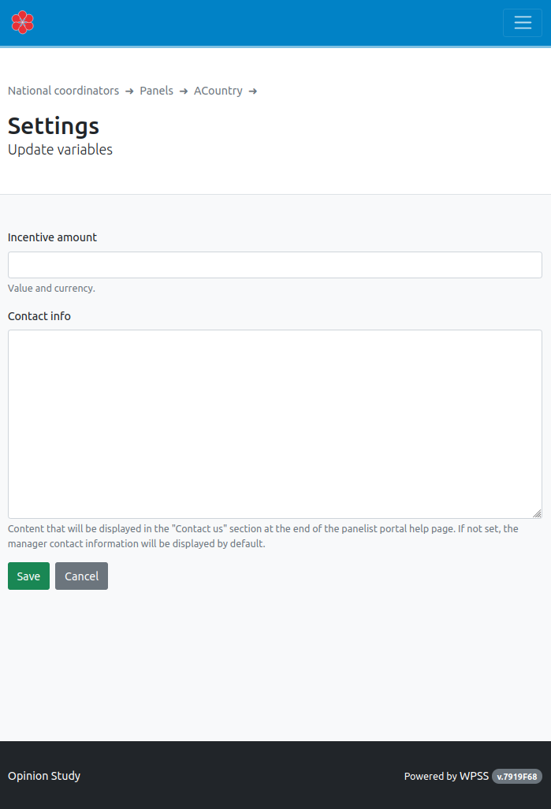

# Panelist portail Help text (or Sample level variables)

WPSS allows for regionalisation of sample-dependent information displayed to the panelist on the [main help page](../p/index.md).

A sample manager, can define, at a sample level, two specific informations:

- the incentive amount and currency
- the contact details (name, email address, phone number) of the sample support contact.

To do so, first select the sample in the homepage (if relevant):

Then choose the `Settings` card.

The two variables are displayed on the panelist portal Help page. The help text is defined as part of the [WPSS translation process](../tr/wpss-panelist-portal-translation.md).
