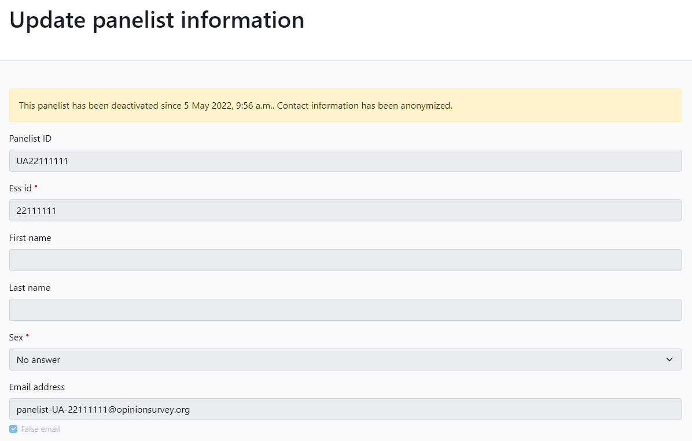
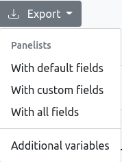
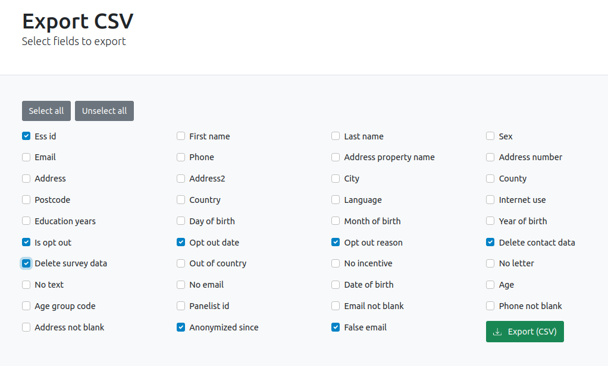

# Panelist deactivation

## Procedure

As soon as you receive an opt-out request from a panelist, you have to use the "Anonymize & Deactivate" feature on WPSS. Here is how it works:

1. Go to a panelist's page and click on . A confirmation screen showing the edited values will appear.
1. Once confirmed, the procedure will overwrite the following fields:

| Field                                                                | New value                                          |
|----------------------------------------------------------------------|----------------------------------------------------|
| [Email](sample-import-export-fields.md#email)                        | panelist-[country_code]-[ess_id]@opinionsurvey.org |
| [Phone](sample-import-export-fields.md#mobile)                       | *Empty*                                            |
| [First name](sample-import-export-fields.md#name)                    | *Empty*                                            |
| [Last name](sample-import-export-fields.md#surname)                  | *Empty*                                            |
| [Address property name](sample-import-export-fields.md#propertyname) | *Empty*                                            |
| [Address number](sample-import-export-fields.md#number)              | *Empty*                                            |
| [Address](sample-import-export-fields.md#address)                    | *Empty*                                            |
| [Address 2](sample-import-export-fields.md#address2)                 | *Empty*                                            |
| [City](sample-import-export-fields.md#city)                          | *Empty*                                            |
| [County](sample-import-export-fields.md#county)                      | *Empty*                                            |
| [Postcode](sample-import-export-fields.md#postcode)                  | *Empty*                                            |
| [Language](sample-import-export-fields.md#lng)                       | *Empty*                                            |
| [Sex](sample-import-export-fields.md#sex)                            | 9                                                  |
| [Day of birth](sample-import-export-fields.md#dybrn)                 | 99                                                 |
| [Month of birth](sample-import-export-fields.md#mthbrn)              | 99                                                 |
| [Year of birth](sample-import-export-fields.md#yrbrn)                | 9999                                               |
| [Education year](sample-import-export-fields.md#eduyrs)              | 99                                                 |
| [Internet use](sample-import-export-fields.md#netusoft)              | 9                                                  |

!!! attention
    1. This contact data change is permanent and cannot be reverted.
    1. The panelist will not be able to log in to the panelist portal anymore.

!!! info
    When a panelist is deactivated, [Is opt out](sample-import-export-fields.md#opto) and [Delete contact data](sample-import-export-fields.md#delcontactdata) boxes will be automatically checked.
    Most of the panelist information will also become read-only, but the following fields can still be edited:

    - [Opt out date](sample-import-export-fields.md#dopto)
    - [Opt out reason](sample-import-export-fields.md#ropto)
    - [Delete survey data](sample-import-export-fields.md#delsurveydata)

    You can retrieve the deactivation date at the top of the panelist's page:

    

## Reports

To facilitate weekly reporting of deactivated panelists to the project DPO, Sample Managers can export their sample as a CSV file containing all necessary information.

From the panelists view, click on "Export" > "With custom fields".

You can now select which fields you want to export, for example:

- [ESS ID](sample-import-export-fields.md#idno)
- [Is opt out](sample-import-export-fields.md#opto)
- [Opt out date](sample-import-export-fields.md#dopto)
- [Opt out reason](sample-import-export-fields.md#ropto)
- [Delete contact data](sample-import-export-fields.md#delcontactdata)
- [Delete survey data](sample-import-export-fields.md#delsurveydata)
- [Anonymized since](sample-import-export-fields.md#anonsince)
- [False email](sample-import-export-fields.md#falseemail)

Filtering this CSV on anonymization dates will help create report files.
