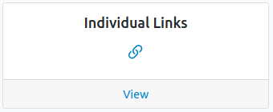
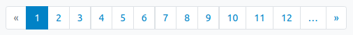

# Survey monitoring

## Overview

To view a list of surveys that have been published to your assigned sample, select the `Individual links` card.

Select the blue `Details` button to display the panelists for whom an individual link has been created, as well as a (bright) color indicating the response status (`red` as not started, `yellow` as started and `green` as finished).

Results can be filtered by study ID (ESS ID) by clicking the `Filters` grey button.

| Category                                                                         | Notes                                                                                                                                                                                                                                 |
|----------------------------------------------------------------------------------|:--------------------------------------------------------------------------------------------------------------------------------------------------------------------------------------------------------------------------------------|
| Not Started                  | Panelist did not start the survey                                                                                                                                                                                                     |
| Started                      | Panelist started the survey, but did not complete it. The survey deadline still allows him/her to finish the survey                                                                                                               |
| Partially Finished | Panelist started the survey, but did not complete it. The survey deadline no longer allows him/her to finish the survey. His/her responses are recorded                                                                             |
| Finished                       | Panelist completed the survey by answering all questions                                                                                                                                                                              |

A red dot idicates a filter is active. The blue label shows the total sample size and records filtered.
To deactivate a filter, click the `Reset`button.

Results can be browsed page by page using the pagination at the bottom of each page.

## Exporting response statuses ##

To get individual response status as a CSV file, click on the grey `Export response statuses` button

You will get a two-columns CSV file, one record for each person in your assigned sample:

`ess_id`

: as defined [here](./sample-import-export-fields.md#idno)

`status`

: values being one of:

     `Pending`

     : panelist did not yet enter the survey

     `SurveyStarted`

     : panelist did enter the survey

    `SurveyPartiallyFinished`

    : panelist started the survey but did not finish it and cannot return to it because the survey deadline is over (see [survey parameters](../survey/survey-creation.md#mandatory-manage-partial-responses))

     `SurveyFinished`

     : panelist completed the survey
