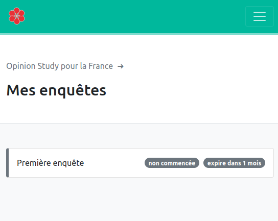
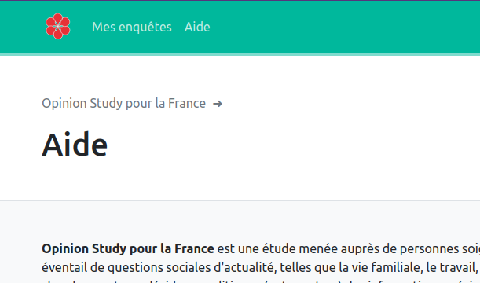

# In brief: panelist

Panelist accounts are created when data is first imported to a sample by a sample manager. A panelist belongs to **exactly one sample**.
Once logged into the portal, the panelist may perform the following tasks:

- view and update personal data
- update preferences, such as preferred mode of contact
- access their sample manager contact details, for requests regarding non-editable data fields (date of birth, gender), opting-out or GDPR-related.
- access direct links to answer available surveys

- access contextual information related to the study (help menu option, including legal mentions regarding GDPR). Informations available here have been recorded by the [sample manager as detailed here.](../nc/panel-level-variables/#sample-level-variables)

