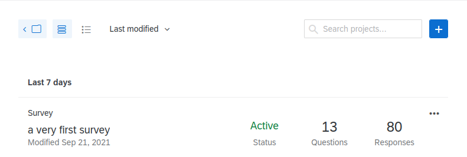
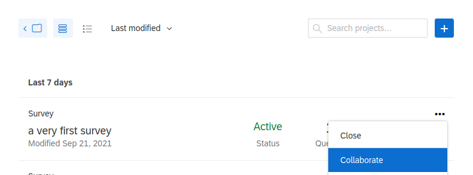
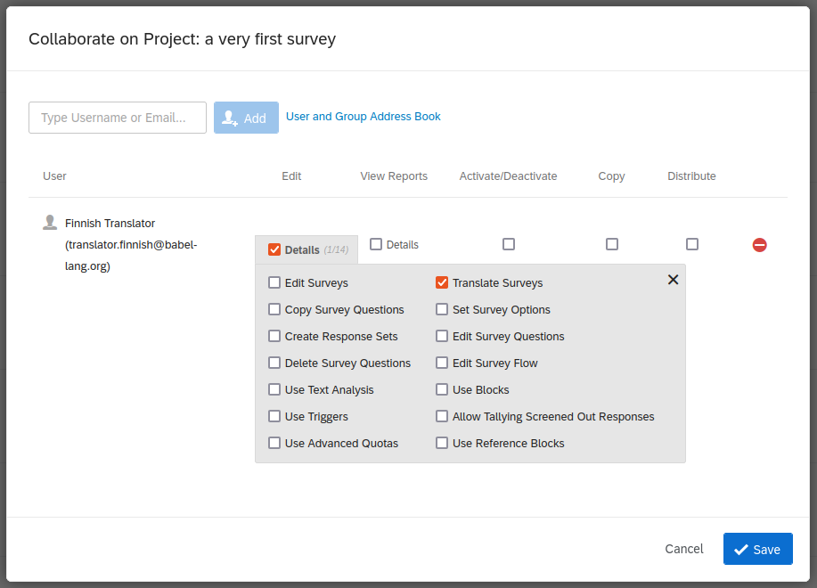
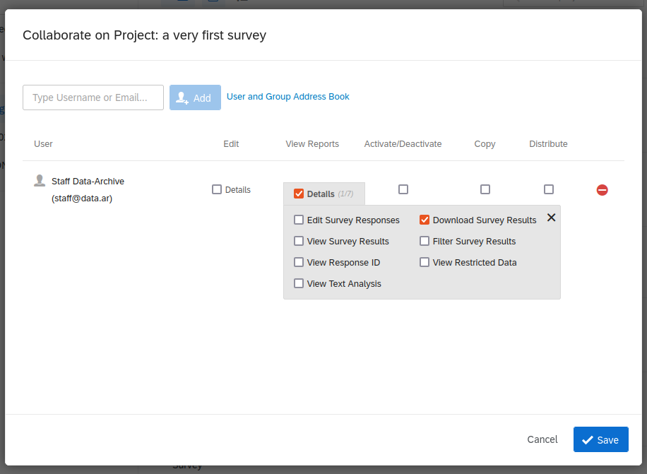

# Invite collaborators

Before a survey can be ready for publication, the survey manager will have to invite translators , give access to the survey dataset to the authorized data archive staff, and finally share the survey with WPSS when it's ready for publication.

### Invite translators
The purpose is to grant access right to survey translation feature to a selected list of translators accounts. A dedicated `User Type` can be useful there.

Select `Projects`.

Click on the survey `menu` on the right displayed as three dots `⋯`. Select the `Collaborate` item in the menu:

Declare translator accounts as collaborators. Restrict permissions as follows:

### Invite data archive staff
The pupose is to restrict access right to survey dataset download to the archive staff only. A dedicated `User Type` can be useful there.

Select `Projects`.

Click on the survey `menu` on the right displayed as three dots `⋯`. Select the `Collaborate` item in the menu:

Now declare data archive staff accounts as collaborators who need to download the survey dataset. Restrict permissions as follows:

