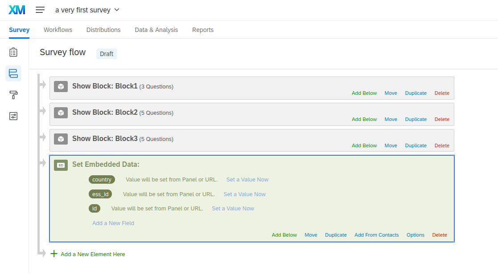

# Create a survey

At survey creation setting security parameters is mandatory. Optionnally, the survey editor can modify the survey styling as desired, design paradata collection and embed WPSS data.

## Mandatory: Define security parameters

Go to : `Project ➡ Survey Options ➡ Security` and select `Survey Access ➡ By invitation only` as shown below:


Select aloso `Anonymise responses`:


<!-- Optionally, we can choose to set a date range for survey validity, and add a custom message when a panelist tries to access an expired survey by clicking a link. -->

## Mandatory: Manage incomplete responses

To control precisely how incomplete responses should be managed, a coherent options set must be chosen. Yo may chose to record or get rid of incomplete responses.

The schema belows shows recommended options (available but not recommended options are greyed).


You may also grant an additional grace period from one hour to one year to allow respondents to finish a questionnaire. The grace period can start either the first time the respondent opens the survey, or the last time the respondent answered a question. The relevant options in Qualtrics are shown below :


This can produce such a scenario:

1. A set of individual links is created, with a **one month** validity.
1. Individual links are distributed to respondents using messages on March the 1st.
1. On Qualtrics, the deadline for incomplete responses is set to one month, starting at "survey start time".

As a result:

 - A respondent who opened the survey on the distribution day (March the first) is able to complete the survey until the end of March.
 - A respondent who opened his survey on March 30 gains a one month grace period (until April 30).
 - On May the first, all incomplete responses are recorded, with a [`partially finished status`](../hq/fieldwork.md#response-rates), no respondent can carry nor complete the questionnaire. The survey stats are final.


## Mandatory: Embed data

A controlled sub-set of personal data hosted on WPSS are shared with the survey platform for the purpose of survey routing, filtering, and survey dataset production. The variables are available for survey editors to use. The list of variable is as follows:

- `panel`
- `country`
- `ess_id`
- `id` (concatenation of `country` and `ess_id`)
- `sex`
- `title`

To include embedded data in the dataset export file, you have to declare embedded data in the `Data Flow` as shown below:




You do not have to declare embedded data in the data flow in order to use it as survey branching conditions. This operation is needed to include this data in the survey dataset.

## Design paradata collection

To collect timestamps paradata, go to `Project ➡ Survey Flow` and declare an `embedded data Field` below each survey block as:

```${date://CurrentDate/c}```


## Customize survey style

Select `Look and feel` : Custom theme: Edit


In the Custom CSS box, you can add a piece of CSS code.


Highlighted in grey below is the custom CSS that is already included in a custom theme, created by the survey platform administrator.
If you observe that a modification doesn’t show, you can add the rule `!important` to the property to override it from the source theme.

```css
/* Remove some whitespace */
#HeaderContainer { display: none; }

/* Hide the progressbar (which also removes some whitespace) */
#ProgressBar { display: none; }

/* Hide the language selector*/
.LanguageSelectorContainer { display: none; }

/* Remove items background for radio buttons */
label:not(.q-radio) { background: transparent !important; }

/* Remove a bit of whitespace around answers */
.Skin .MC li .LabelWrapper { margin-top: 0; margin-bottom: 0; }

/* Reduce blank space at the top */
/* @media specifies values used on mobile devices */
.Skin .SkinInner { padding-top: 20px; }
@media (max-width: 480px) { .Skin .SkinInner { padding-top: 10px; } }

/* Change font sizes */
.Skin .QuestionText { font-size: 20px; }
.Skin .QuestionBody { font-size: 20px; }
@media (max-width: 770px) {
    .Skin .QuestionText { font-size: 18px; }
    .Skin .QuestionBody { font-size: 18px; }
}

/* Change spaces around responses items */
.Skin label.SingleAnswer, .Skin label.MultipleAnswer  {
padding-top:0px !important;padding-bottom:0px !important;
}

/* Change spaces around questions */
.Skin .QuestionText, .Skin .QuestionBody {
padding-bottom:0px !important;padding-top:0px !important;
}
```

