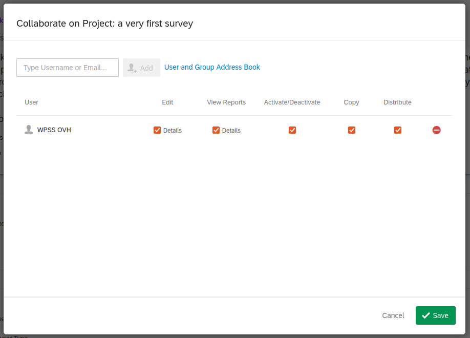

# Survey pre-publication on WPSS

???+ Warning ""
    Questionnaires are created within the survey platform and [sent by the study coordinator on WPSS](../hq/inviting-respondents/#inviting-panelists-to-answer-a-survey).
    For that purpose, each questionnaire must be shared with a specific account on the survey platform.

For each wave, you will have to share the survey with the WPSS operational account.

Select `Projects`. Then click on the survey `menu` on the right displayed as three dots `⋯`.

Select the `Collaborate` item in the menu, and declare the WPSS specific account givent to you by the Study Coordinator as shown below:

The `Distribute` option is mandatory.
The survey is now available for the [Study Coordinator to publish to several samples](../hq/fieldwork.md).
