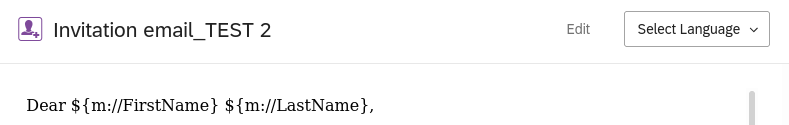
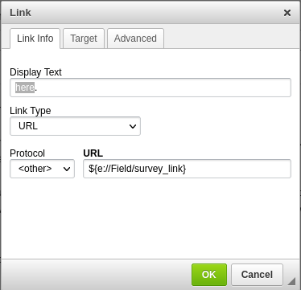
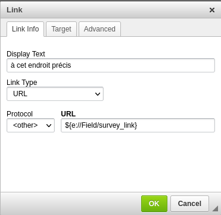

# Messages translation

As a preliminary step, a [message editor has created source messages in a source language](../m/message-edition.md) in a shared messages Library, questionnaire translators can now translate messages.

Once a translator has been given appropriate access to the shared messages Library on the survey platform, it is possible to add as many translation as needed.

Once connected to the survey platform, select "Library" on the right side of your screen. Click on your name on the top left and choose the shared messages Library that you have been given access to.

Now you will see this shared Library displayed where your name appeared in the first place: meaning you are browsing the shared messages library.

You are now browsing the shared Messages Library. You can see:

- emails
- emails subject (emails subjects are treated as separate content by the survey platform)
- short text messages

## How to translate messages
To start typing your translation, click the gear icon on the right, in the message list, and select `Translate Message`:

The translation process is very similar to translating questionnaires:

- you first need to select your language in the drop-down list
- the rich content editor is activated
- the box on the right will appear pre-filled with a copy of the source text
- you should overtype your translation there
- the auto-save feature is activated, you don't need to save your translation
- placeholders beginning with a dollar sign `$` and enclosed in brackets `{}` must remain unmodified (i.e. not to be translated). Such strings will be automatically replaced by relevant values.

 

## How to translate the survey hyperlink
The message editor can choose not to display a weird and long survey link in the emails. The link is then hidden as an hyperlink behind a text string, for example `Click here`. 
You will have to replace this word `here` by your translated word or expression, while keeping the hyperlink. This is key, as this link is the actual link to the survey.

To do so, click on `Translate` using the gear icon on the right.
 Select your language in the drop-down list on the right half of the screen.

Click on the hyperlinked text (displayed in blue, and underlined) `Click here`, an hyperlink editor pops up.
Be careful to modify **only** the `Display Text` as shown below (translation from english to french)

  to  

Do not edit or modify the `URL` and `Link Type` fields.
## Troubleshooting
If you don't see your language in the language chooser (drop-down list), contact your translation support.
if you get on the right an all-white and empty box instead of a box pre-filled with the source text (as shown below), reload your page (using ++ctrl+"R"++ key combination) and select again your language in the drop-down list to correct.
