# Questionnaire translation
Provided that the [survey owner has declared as many translators as needed](../../survey/survey-collaboration/#invite-translators), each translator is now able to acces the survey platorm to type, import and preview questionnaire translations.

As a preliminary step, a [survey editor has created a questionnaire in a source language](../survey/survey-creation.md) and has invited several questionnaire translators to collaborate on the questionnaire.

Once a translator has been declared as a collaborattor on the survey platform, the questionnaire appears as a project on the survey platform and can be selected. In the questionnaire main menu, select:

```Survey options ➡ Translations ➡ Translations overview```

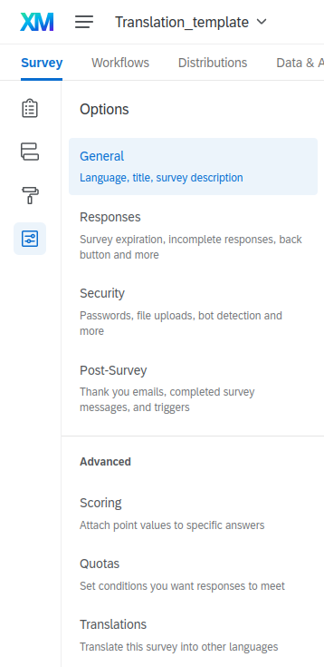

## translation overview

This overview shows as, a first column, the source language in which the questionnaire was created, and as many columns as it has already been translated into other languages.

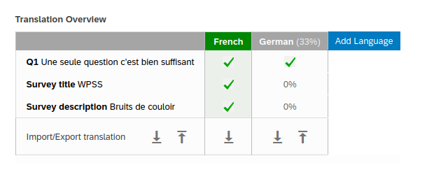

## adding a language to a questionnaire

First, pick a language, [in the project agreed list of languages.](../../nc/sample-import-export-fields/#lng)

Either select an available language from the survey platform list:

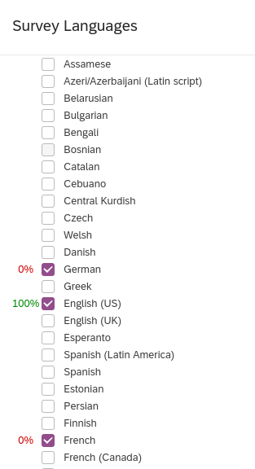

Or add a custom language:

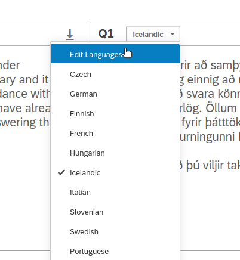

The option to create a custom language is to be found after the last language item:

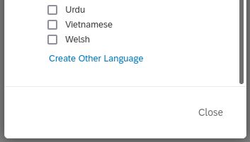

Choose a meaningful language name and code.

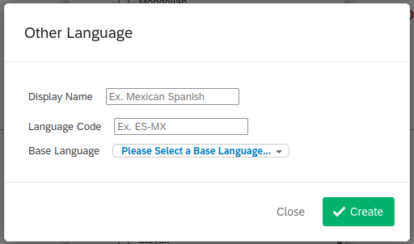

## typing translations
General instructions to use the translation editor are 
[available on the survey platform user guide relevant section.](https://www.qualtrics.com/support/survey-platform/survey-module/survey-tools/translate-survey/#UsingTranslateSurvey)

In order to keep the layout of the source questionnaire, it is advised to paste any content (for example from a wordprocessor file) without keeping any formatting. To do so, use the key combination  ++ctrl+shift+"V"++  instead of the usual ++ctrl+"V"++  key combination to paste a translated text part into the translation box.
## processing translations by batch
### downloading the translation file
First, download the translation file
It is mandatory:

- to have declared every language that the survey will be translated to,
- to keep the structure of translation files untouched, that is:

    * a first row with languages codes
    * a first column with PhraseID
    * the exact row count
    * as a comma separated value (CSV) file, tab separated values with non field delimiter (neither ' nor ")

[Visit the survey platform user guide.]( https://www.qualtrics.com/support/survey-platform/survey-module/survey-tools/translate-survey/#ImportingATranslation )

To download the complete translation file, use the very first downwards arrow next to `import/Export translation` text on the very left of the base row.
Select `Unicode Text (Excel)` format, and `ALL` languages as shown below:

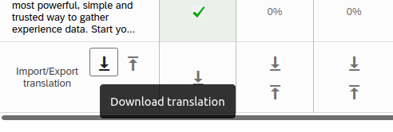 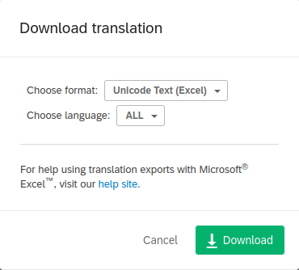

### transform a translation file

To edit the translation file, the safest way to go is to use Libreoffice. First, open the file by following these steps:
right click on the translation file then select `Open with`, choose `LibreOffice Calc`.

You should see every field displayed properly now. Edit as needed, provided that your final translation file for one language is structured as described below.

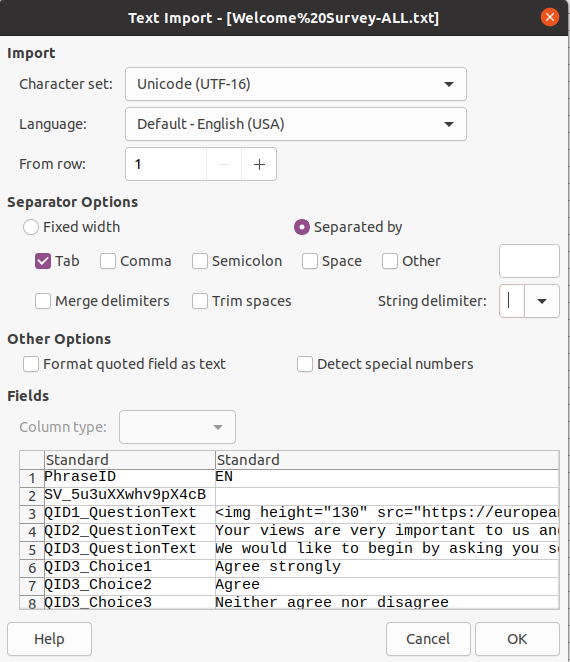

### save a translation file

To backup the file after modification: select `save as`, select `Text CSV`, then select precisely options shown below:

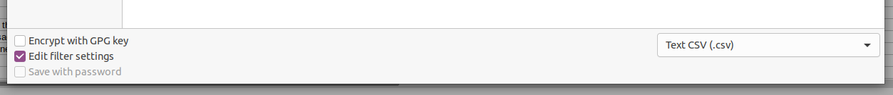


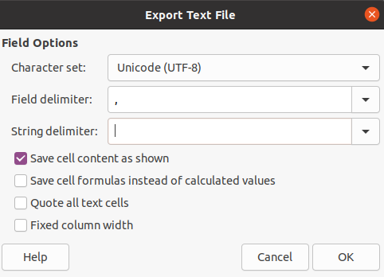

### upload back a translation file
It is advised to import one language at a time. To do so, please follow these steps:

The source language appears in a green column.


To upload a one-language translation file, use the upward arrow in the corresponding language column.


You will be prompted to upload your one-language translation file :

You can visit [specific instructions to import a translation file](https://www.qualtrics.com/support/survey-platform/survey-module/survey-tools/translate-survey/#UsingTranslateSurvey) on the survey platform online documentation.
