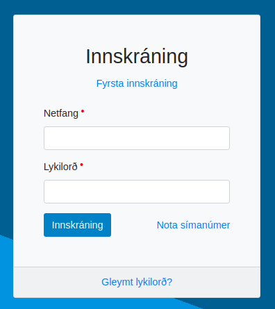
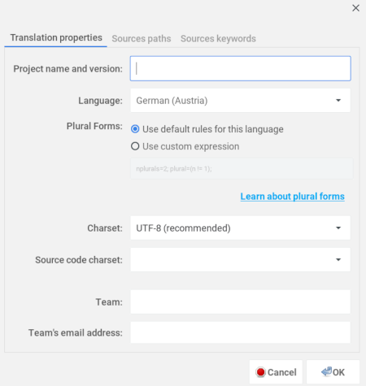
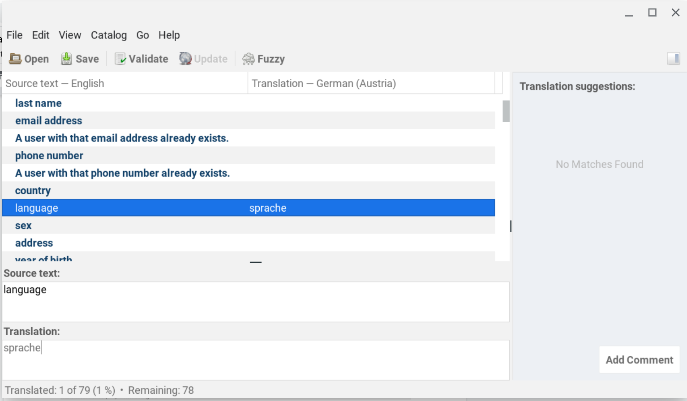

# Panelist portal translation

This step has to be performed **once**, when the WPSS is setup for a study.

Potentially, every page from the WPSS portal (study coordinator pages, sample managers pages, panelist portal pages) could be translated in every locale used. The translation mechanism is strictly identical.

What is out the scope of this guide is translating content managed from the survey platform: [survey-related emails, short text messages](messages-translation.md) and [questionnaires](questionnaire-translation.md).

???+ Important

    The user interface relies on the language set on the user’s browser.



The mechanism used here relies on Django application translation capacity, using translation `.po` files. It is scalable, and can support as many Django languages as desired.

The web development team will produce as many `.po` file as needed.
Such a `.po` file has to be edited with a specific editor, we recommend to use a translation editor named [poedit](https://poedit.net).

## Translation steps

- install poedit on your computer, using this [link](https://poedit.net/download)
- open the `.po` file with poedit,
- set the language property  `Translation ➡ Properties`
- choose the relevant language for the translation in the drop-down list:



- choose `UTF-8` as the desired encoding.
- start typing a translation for each item of the source text (displayed) in bold, in the Translation box.



- once the translation is complete, save the `.po` file and send it back to the web development team.

## Keep formatting tags unmodified
You may have to translate a text that is enclosed in HTML tags, similar to the following:

```<p>
Forgot password?
</p>```

Do not translate the formatting elements. Your translation of the above block should look like:

```<p>
Mot de passe oublié ?
</p>```

In addition, you may find placeholders that must not be translated :

```[%(site_name)s] Confirm email change```

Correct translation for this sentence in french would look like this :

```[%(site_name)s] Confirmez le changement d'adresse email```

##
