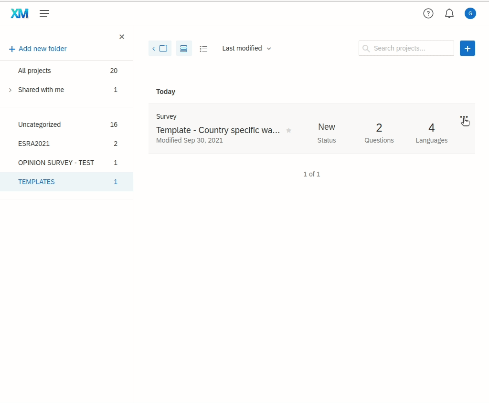
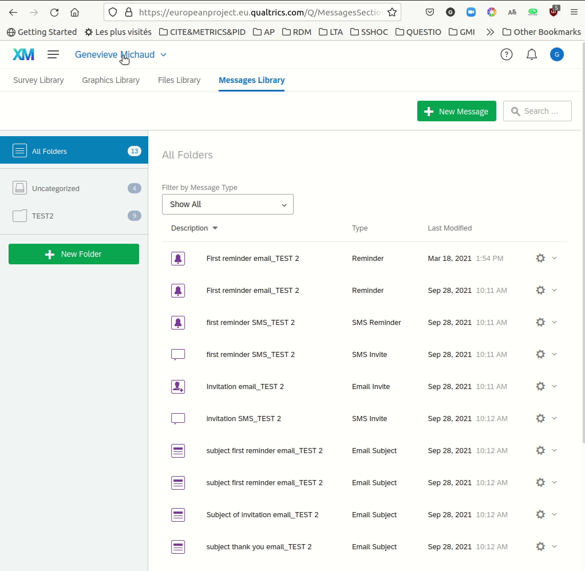

In this use case, the system will be used to invite one sample only, to answer a questionnaire. Contents items, i.e. questionnaire and messages will only be translated into languages that are used by this sample.

The scenario could be drafted as below:

The national coordinator:

- Creates a questionnaire on the survey platform. The questionnaire should be translated into english and sent to ESS-ERIC and REB 
- Shares the questionnaires with a Qualtrics operational account.
- Creates messages on the survey platform in corresponding language(s),
- Put messages in the dedicated shared Messages Library, to be used for invitations and reminders.

Head-quarters :

- Finally, a study coordinator triggers country-specific invitations for country-specific questionnaires simultaneously.

## Creating a survey

Use the template set by the european coordination.

Translation, publication, preview ...

It follows the project specific guidance and fulfills prerequisites.

## Declare the WPSS operational account as collaborator.

<!--## Creating messages

Use a meaningfull prefix to your messages, to avoid errors when sending emails from WPSS.

FR-w3-invite-email

F3-w3-invite-subject

F3-w3-invite-sms

FI-w3-1streminder-SMS

  -->

