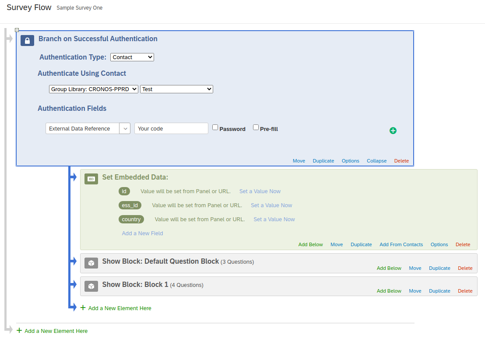
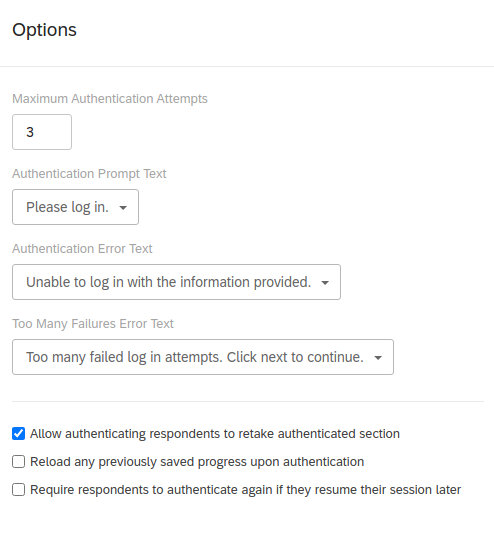

# Push to web survey instrument
## 2020, when academic surveys where pushed to transform
Face to face surveys are often preferred in big academic surveys, for several reasons. However, the year 2020 created a disruption, where  many survey fieldwork were suddenly interrupted by government lockdown measures.
## What is meant by  `push to web`?
<!-- According to push to web design (citation needed) for social sciences surveys: -->
After a probabilistic household sample has been drawn using preferred methods, this survey recruitment methodology called `push to web` aims to invite members of households to participate in a web survey. Each household, of which only a postal address is known, is sent a postal letter. This letter is an invitation (hence the `push` action) for member(s) of the household to connect to a web page. The intention is to collect email addresses from members of the houselhold, and seek their consent to participate in the study. The maximum number of houselhold members emails addresses collected depends on the collection design.
## Our proof of concept
We designed a proof-of-concept for this purpose, using Qualtrics© as the survey platform. This method could easily be implemented with other survey platforms.
### Constraints
- Provide a short URL to the online recruitment survey (this design requires the survey URL printed on a postal letter be typed onto a web browser, or alaternatively can use a QR code for this purpose)
*[QR code]: for **Q**uick **R**esponse code, a type of machine-readable optical label that can contain information about the item to which it is attached, often pointing to a website. 
- Do not use a public link as a survey link (require authentication)
- Provide a custom authentication to the survey, with simple and short codes, to be printed on the invitation postal letter. It should be short and non ambiguous, so that each respondent is able to type it without errors into a web browser address bar.
- Provide a mean to authenticate several members of each household (a code count can be set up at the survey level, the number of household members is a controlled parameter)
## Method
Create a survey, using the survey platform (no specific licence option needed).
The survey will be configured to require authentication. The more straightforward method available is to upload a text file including random and unambiguous short codes that will be used as login (strings). One code will be provided for each household, each code will allow a precise login count, i.e. to be used by a precise number of members of the household. For example if we want to collect a maximum of 4 respondents for each household, we will set up the `max login count` set to 4.
## Step by step
#### **Step 1: sample file preparation**
The CSV file must contain at least 2 variables per household:

- `Email`
This is a requirement from the survey platforme but we can use fake addresses.
- `ExternalDataReference`
The value of this variable will be a unique code that will be used to authenticate each person in each household. 1 code per household since it can be used multiple times.
#### **Step 2: import the sample file in the survey platform**
Go to `Contacts ➡ Create Mailing List` and enter the name of the list. Then `Add Contacts` and import the file created during step 1.
#### **Step 3: survey configuration**

- **General survey options**
In `Survey Options`:
Enable `Open Access. Allow anyone to take this survey.`
Disable `Prevent Ballot Box Stuffing. Keep people from taking this survey more than once.`

- **Survey flow**
To enable the authentication on a survey, go in your survey project page and click on `Survey Flow`. Then add the `Authenticator` element by clicking on `Add a New Element Here`. Make sure that this element is placed at the top of the survey flow since we want the respondent to authenticate first (you can move elements by dragging the `Move` option and dropping it where you want). All the other elements should be placed inside the `Authenticator` branch so they can be accessed only if the user has been successfully authenticated.

You will then have to configure the authenticator element:

- Authentication Type: `Contact`
- `Authenticate Using Contact`: choose the library and then the mailing list imported in step 2
- `Authentication Field ➡ External Data Reference` (note: you can also add an optional label that will be displayed in the survey instead of `External Data Reference`)
- In the `Options` element, make sure `Allow authenticating respondents to retake the authenticated section` is checked so that one invite can allow multiple answers (for every person in the household). Other useful options can also be tweaked as you need (If a respondent tries to authenticated more than the `Maximum Authentication Attempts` value, the survey ends.).

You should get something similar to this:

You can now save the survey flow.

#### **Step 4: start the survey**
Publish the survey and distribute the anonymous link, to be found under `Distributions ➡ Anonymous Link`. Each respondent will have to type their code to be able to answer the survey.

#### **Step 5: end of the survey**
When the survey ends, you might need to do some housekeeping on the data collected to remove incomplete answers, duplicate answers, and eventually randomly select the answers count to keep for each household.

#### **After the fieldwork**
Once the push to web is completed, you can use the new sample file created from the answers as a [sample import file for WPSS](../nc/sample-import-export-fields.md).
