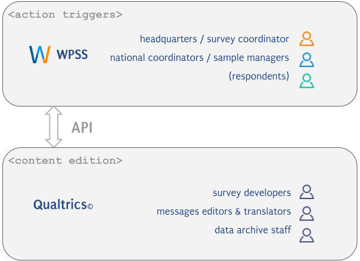

# The software

During the first part of the project, ESS-ERIC and the CDSP specified and drafted the software and published a first deliverable in the form of the [software specifications](https://doi.org/10.5281/zenodo.3595981).

We choosed a two-fold information system, taking the most out of features already available in the chosen survey platform, and designing a web application (WPSS) from which actions are triggered.

The two components are coupled through the survey platform API.

*[API]: Application Programming Interface

Several [users roles](roles.md) are defined and collaborate. They either are granted access to the WPSS web application, or to the survey platform, as described below:

